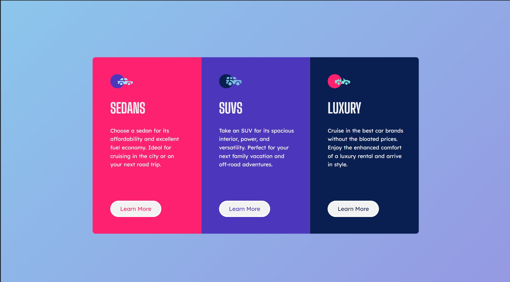

# Frontend Mentor - 3-column preview card component solution

This is a solution to the [3-column preview card component challenge on Frontend Mentor](https://www.frontendmentor.io/challenges/3column-preview-card-component-pH92eAR2-). Frontend Mentor challenges help you improve your coding skills by building realistic projects.

## Table of contents

- [Overview](#overview)
  - [The challenge](#the-challenge)
  - [Screenshot](#screenshot)
  - [Links](#links)
- [My process](#my-process)
  - [Built with](#built-with)
  - [What I learned](#what-i-learned)
- [Author](#author)

## Overview

### The challenge

Users should be able to:

- View the optimal layout depending on their device's screen size
- See hover states for interactive elements

### Screenshot




### Links

- [Solution URL](https://www.frontendmentor.io/solutions/my-solution-to-the-3-column-card-component-z55FdrsG1v)
- [Live site URL](https://zp021-3-column-card-component.netlify.app/)

## My process

### Built with

- Semantic HTML5 markup
- CSS custom properties
- Flexbox
- Mobile-first workflow

### What I learned

The most challenging part for me was getting the button hover effect right. My thought was to try to get it with just the button class and button class on-hover, but couldn't it right without going into each class and setting the color property. I also used different colors for this challenge to add a personal touch.

```css
.btn-learn-more {
    font-family: "Lexend Deca", sans-serif;
    font-size: 1rem;
    font-weight: 400;
    width: 9.375rem;
    height: 3.125rem;
    border: 3px solid white;
    border-radius: 2rem;
    cursor: pointer;
    background-color: var(--clr-white);
    transition: 0.5s ease-in-out;
}

.sedans .btn-learn-more {
    color: var(--clr-sedans);
}

.suvs .btn-learn-more {
    color: var(--clr-suvs);
}

.luxury .btn-learn-more {
    color: var(--clr-luxury);
}

.btn-learn-more:hover {
    background-color: transparent;
    color: #fff;
```

## Author

- Frontend Mentor - [@zp021](https://www.frontendmentor.io/profile/zp021)
- GitHub - [@zp021](https://github.com/zp021)
